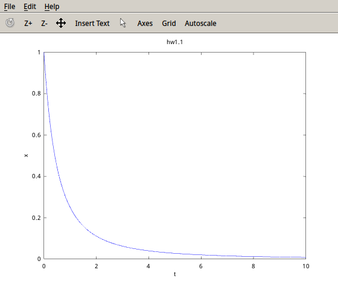

# Homework1
###Yufeng Yuan
- - -

###Homework1.1
###The Mathematical Equations
$$$
\frac{x(t_{n+1})-x(t_n)}{\Delta t} = -x(t_{n+1})\\
(1+\Delta t)x(t_{n+1})=x(t_n)\\
x(t_{n+1})=\frac{x(t_n)}{1+\Delta t}\\
x(t_n)=\frac{1}{(1+\Delta t)^n}
$$$
###Source Code
```matlab
% hw1.1
delta_t = 0.01;
t = [0 : delta_t : 10];
% the formula derived
x_tn = 1 ./ (1 + t).^2;
plot(t, x_tn), xlabel('t'), ylabel('x'), title('hw1.1');
```
###Output


###Homework1.2
###The Linear Equations
$$$ 
k(-T_{j-1}+2T_j-T_{j+1})=0\\
2T_2-T_3=30\\
-T_2+2T_3-T_4=0\\
-T_3+2T_4=100
$$$
###Source Code
```matlab
% hw1.2
A = [2, -1, 0;
     -1, 2, -1;
     0, -1, 2];
B = [30; 0; 100];
% solve linear equation AX = B
X = A\B
```
###Output
```matlab
>> hw1_2

X =

   47.500
   65.000
   82.500

>>
```

