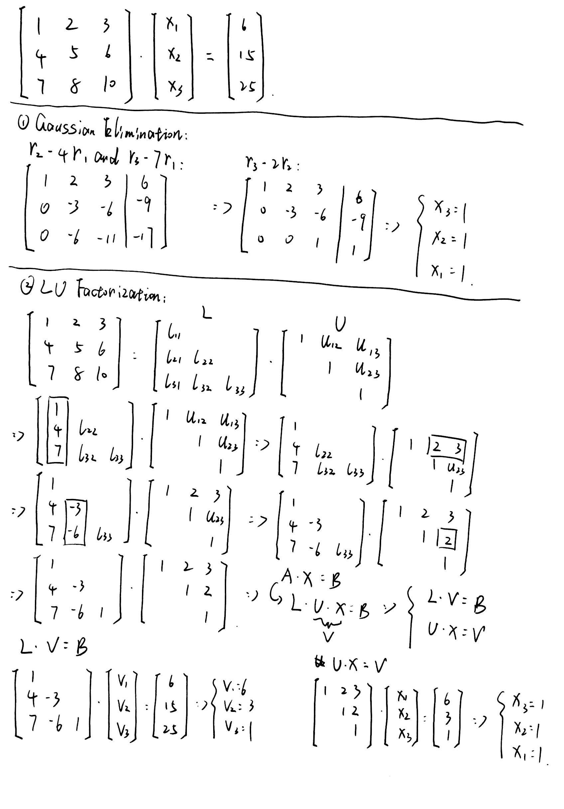
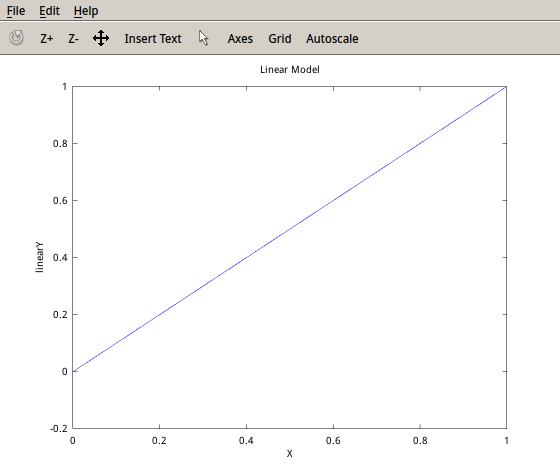
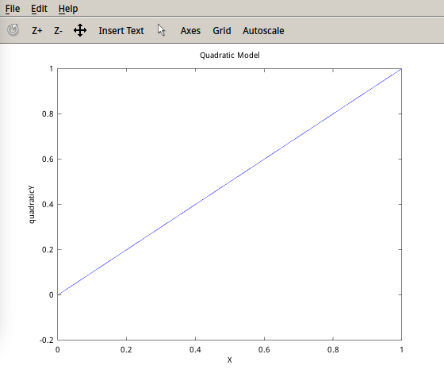

# Homeowrk2
###Yufeng Yuan

- - -

###Problem1


### Problem2
#### Source Code
```matlab
x = [0 : 0.25 : 1]';
y = [0 : 0.25 : 1]';
%rewrite the x matrix
x1 = [x, ones(5,1)];
x2 = [x.^2, x, ones(5,1)];
%solve the coefficients
c1 = x1 \ y;
c2 = x2 \ y;
%generate predicted y
y1 = x1 * c1;
y2 = x2 * c2;
%plot figure of linear model
figure(1);
plot(x, y1), xlabel('X'), ylabel('linearY'), title('Linear Model');
%plot figure of quadratic model
figure(2);
plot(x, y2), xlabel('X'), ylabel('quadraticY'), title('Quadratic Model');
```
####Plot


####Coefficient
```matlab
>> c1
c1 =

   1.0000e+00
  -2.2044e-16

>> c2
c2 =

  -1.7659e-15
   1.0000e+00
  -1.1102e-16

```
