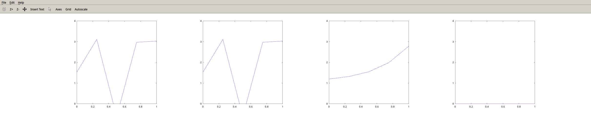

### Homework3
Yufeng Yuan
yy208@duke.edu

- - -

##### Problem1 and 2

##### Problem3
source code
```matlab
lambda1 = 1e-6;
lambda2 = 1;
lambda3 = 1e6;

x = [0, 0.25, 0.5, 0.75, 1];
y = [1.53, 3.11, -0.61, 2.97, 3.03];

A = [x'.^4, x'.^3, x'.^2, x', ones(5,1)];
reg1 = lambda1*diag(ones(5,1));
reg2 = lambda2*diag(ones(5,1));
reg3 = lambda3*diag(ones(5,1));


A_reg1 = [A;reg1];
A_reg2 = [A;reg2];
A_reg3 = [A;reg3];
B = [y';zeros(5,1)];

alpha1=A_reg1\B;
alpha2=A_reg2\B;
alpha3=A_reg3\B;
subplot(1,4,1);
plot(x, y); axis([0,1,0,4]);
subplot(1,4,2);
plot(x, A*alpha1); axis([0,1,0,4]);
subplot(1,4,3);
plot(x, A*alpha2); axis([0,1,0,4]);
subplot(1,4,4);
plot(x, A*alpha3); axis([0,1,0,4]);
```
Plot

coefficients1 =
  -249.8133   509.1200  -314.9466    57.1400     1.5300
coefficients2 =
   0.43225   0.42187   0.37412   0.35462   1.19751
coefficients3 =
   3.9437e-12   4.2553e-12   4.7425e-12   5.7300e-12   1.0030e-11