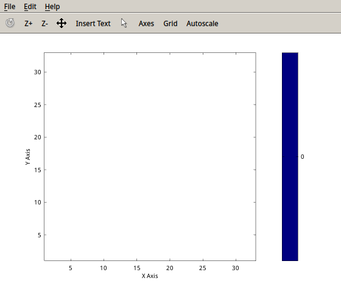
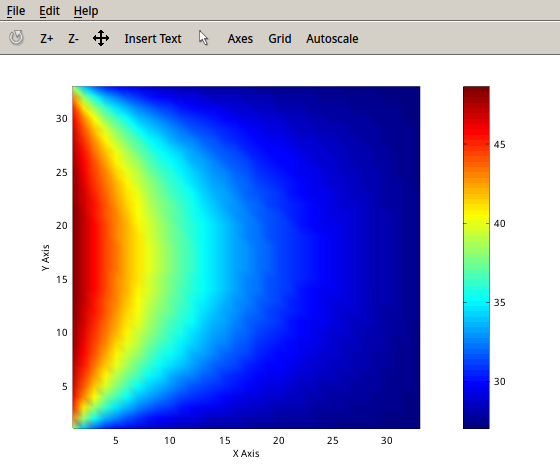
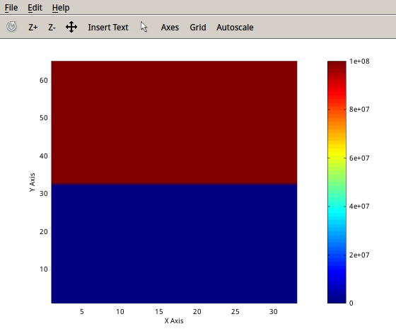
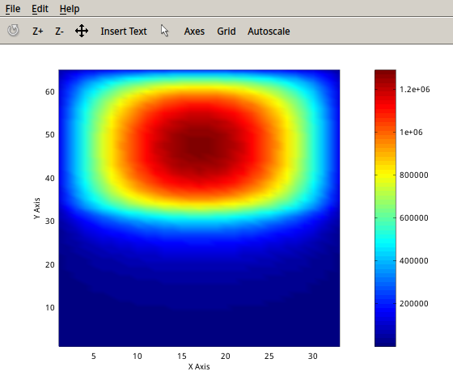
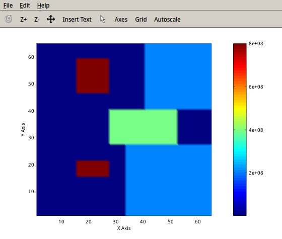
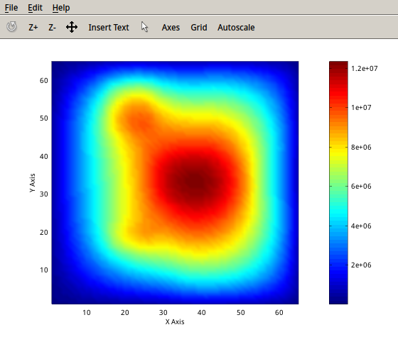

### Project 1: 2-D Thermal Analysis
Yufeng Yuan
yy208@duke.edu

- - -

##### Abstract
##### 1.Mathematical Formulation
This is the original heat equation, which is a 2nd-order linear PDE
$$
\rho \cdot C_p \cdot \frac{\partial T(x,y,t)}{\partial t}=
\kappa \cdot \triangledown^2T(x,y,t)+f(x,y,t)
$$
The heat conduction has reached a steady state, so the equation can be simplified
$$
\kappa \cdot \triangledown^2T(x,y)+f(x,y)=0
$$
Explicitly write down the laplace operator
$$
\kappa \cdot [\frac{\partial^2T(i,j)}{\partial x^2}+\frac{\partial^2 T(i,j)}{\partial y^2}]=-f(i,j)
$$
The 2nd-order term can be written as the follows with finite difference method
$$
\frac{\partial^2T(i,j)}{\partial x^2}=\frac {T_{i+1,j}+T_{i-1,j}-2T_{i,j}}{\Delta x^2}
\frac{\partial^2T(i,j)}{\partial y^2}=\frac {T_{i,j+1}+T_{i,j-1}-2T_{i,j}}{\Delta y^2}
$$
Combine all linear equation
$$
\kappa \cdot [\frac {T_{i+1,j}+T_{i-1,j}-2T_{i,j}}{\Delta x^2}+\frac {T_{i,j+1}+T_{i,j-1}-2T_{i,j}}{\Delta y^2}]=-f(i,j)
\\
(1 \le i \le N,1 \le j \le M)
$$
Rewrite the equation and add $$$ T_c$$$ as the term on the boundary
$$
2(\Delta x^2+\Delta y^2)T_{i,j}-\Delta x^2(T_{i,j+1}+T_{i,j-1})-\Delta y^2(T_{i+1,j}+T_{i-1,j})\\=\frac{\Delta x^2 \Delta y^2 f(i,j)}{\kappa}+T_c\\
(1 \le i \le N,1 \le j \le M)
$$

##### 2.Linear System Solver
When M = N = 2, the simplest linear system are shown below
$$
\begin{bmatrix}
 2(\Delta x^2+\Delta y^2) & -\Delta x^2 & -\Delta y^2 & 0\\
-\Delta x^2 & 2(\Delta x^2+\Delta y^2) & 0 & -\Delta y^2\\
-1 & 0 & 2(\Delta x^2+\Delta y^2) & -1\\
0 & -1 & -1 & 2(\Delta x^2+\Delta y^2)\\
\end{bmatrix}*\\
\begin{bmatrix}
T_{1,1}\\T_{1,2}\\T_{2,1}\\T_{2,2}
\end{bmatrix}=
\\
\begin{bmatrix}
\frac{h^2 \cdot f(1,1)}{\kappa}+T_{c_1}\\
\frac{h^2 \cdot f(1,2)}{\kappa}+T_{c_2}\\
\frac{h^2 \cdot f(2,1)}{\kappa}+T_{c_3}\\
\frac{h^2 \cdot f(2,2)}{\kappa}+T_{c_4}
\end{bmatrix}
$$
##### 3.Experimental Results
<table><tr align="center"><td>Case1 before</td><td>Case1 after</td></tr></table>
<table><tr align="center"><td>Case2 before</td><td>Case2 after</td></tr></table>
<table><tr align="center"><td>Case3 before</td><td>Case3 after</td></tr></table>
<
##### 4.Discussion
##### 5.Extra
##### References