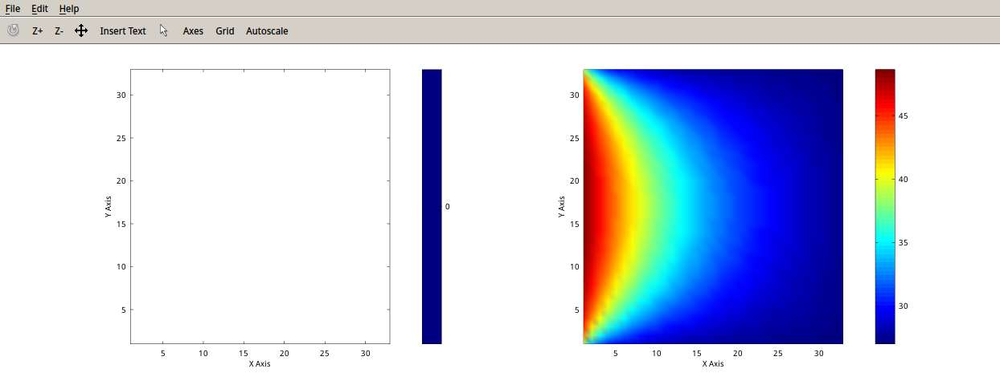
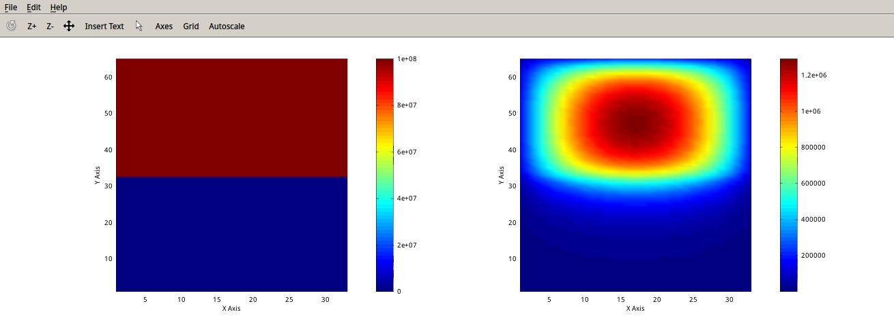
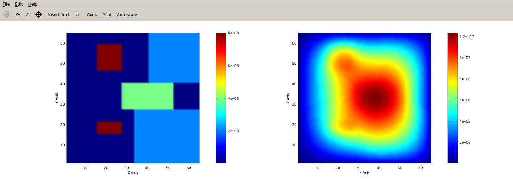

### Project 1: 2-D Thermal Analysis
Yufeng Yuan
yy208@duke.edu

- - -

##### Abstract
In this project, we are given some 2-D thermal distributions and required to solve the steady states of those thermal distributions. Originally, the heat equations are partial differential equations. By applying finite difference methods, we simplify it as a linear system which can be solved by Cholesky Decomposition and back-substitution.
##### 1.Mathematical Formulation
This is the original heat equation, which is a 2nd-order linear PDE
$$
\rho \cdot C_p \cdot \frac{\partial T(x,y,t)}{\partial t}=
\kappa \cdot \triangledown^2T(x,y,t)+f(x,y,t)
$$
For the steady state, the equation can be simplified as
$$
\kappa \cdot \triangledown^2T(x,y)+f(x,y)=0
$$
Explicitly write out the laplace operator
$$
\kappa \cdot [\frac{\partial^2T(i,j)}{\partial x^2}+\frac{\partial^2 T(i,j)}{\partial y^2}]=-f(i,j)
$$
The 2nd-order term can be written as the following with finite difference method
$$
\frac{\partial^2T(i,j)}{\partial x^2}=\frac {T_{i+1,j}+T_{i-1,j}-2T_{i,j}}{\Delta x^2}\\
\frac{\partial^2T(i,j)}{\partial y^2}=\frac {T_{i,j+1}+T_{i,j-1}-2T_{i,j}}{\Delta y^2}
$$
Combine all linear equations
$$
\kappa \cdot [\frac {T_{i+1,j}+T_{i-1,j}-2T_{i,j}}{\Delta x^2}+\frac {T_{i,j+1}+T_{i,j-1}-2T_{i,j}}{\Delta y^2}]=-f(i,j)
\\
(1 \le i \le N,1 \le j \le M)
$$
Rewrite the equation and add $$$ T_c$$$ as the term for boundary condition
$$
2(\Delta x^2+\Delta y^2)T_{i,j}-\Delta x^2(T_{i,j+1}+T_{i,j-1})-\Delta y^2(T_{i+1,j}+T_{i-1,j})\\=\frac{\Delta x^2 \Delta y^2 f(i,j)}{\kappa}+T_{c_{i,j}}\\
(1 \le i \le N,1 \le j \le M)
$$
We get s system of linear equations
$$
A\cdot X = B\\
X=[T_{1,1}, T_{1,2},...,T_{M,N}]^T
$$
When M = N = 2, the simplest linear equations are shown below
$$
\begin{bmatrix}
 2(\Delta x^2+\Delta y^2) & -\Delta x^2 & -\Delta y^2 & 0\\
-\Delta x^2 & 2(\Delta x^2+\Delta y^2) & 0 & -\Delta y^2\\
-\Delta y^2 & 0 & 2(\Delta x^2+\Delta y^2) & -\Delta x^2\\
0 & -\Delta y^2 & -\Delta x^2 & 2(\Delta x^2+\Delta y^2)\\
\end{bmatrix}*
\begin{bmatrix}
T_{1,1}\\T_{1,2}\\T_{2,1}\\T_{2,2}
\end{bmatrix}=
\begin{bmatrix}
\frac{\Delta x^2 \Delta y^2f(1,1)}{\kappa}+T_{c_{1,1}}\\
\frac{\Delta x^2 \Delta y^2f(1,2)}{\kappa}+T_{c_{1,2}}\\
\frac{\Delta x^2 \Delta y^2f(2,1)}{\kappa}+T_{c_{2,1}}\\
\frac{\Delta x^2 \Delta y^2f(2,2)}{\kappa}+T_{c_{2,2}}
\end{bmatrix}
$$
##### 2.Linear System Solver

For the linear system$$$ A\cdot X=B$$$, $$$ A$$$ is a positive definite matrix which we can apply Cholesky Factorization.
$$
A=C \cdot C'
$$
So the original equation can be written as
$$
C \cdot C' \cdot X = B
$$
This is my implementation of Cholesky Decomposition
```matlab
function [S] = choleskyDecom(A)
  [n,n] = size(A);
  S = zeros(n,n);
  for j = 1 : n
    S(j,j) = sqrt(A(j,j) - S(j,1:j-1)*S'(1:j-1,j));
    S(j+1:n,j)=(A(j+1:n,j) - S(j+1:n,1:j-1) * S'(1:j-1,j))/S(j,j);
  end
end
```
Now our task becomes to solve the following two equations, but it's much easier
$$
\begin{cases}
CV=B\\
C'X = V
\end{cases}
$$

$$$ C $$$ and $$$C'$$$ are lower-triangular and upper-triangular matrix, the equations can be easily solved by backward substitution
```matlab
function [X] = choleskySolver(A, B)
  %solve the outer loop of the linear equations
  [n, n] = size(A);
  V = zeros(n,1);
  for i = 1 : n
    V(i) = (B(i) - A(i,1:i-1) * V(1:i-1)) / A(i,i);
  end
  %solve the inner loop of the linear equations
  A = A';
  X = zeros(n,1);
  for i = n : -1 : 1
    X(i) = (V(i) - A(i,i+1:n) * X(i+1:n)) / A(i,i);
  end
end
```
##### 3.Experimental Results
The left side are original thermal distributions and the right side are the thermal distributions of steady state
Case 1
Runtime = 13.0667s

Case 2
Runtime = 169.576s

Case 3
Runtime = 1074.8s

##### 4.Discussion
Using vector operations can greatly accelerate the computation. Originally, I implemented the CholeskyDecomposition and BackSubstitution in a very naive way which means a lot of 'for' loops. It took 3032.15 seconds to solve case 1, which means I wouldn't get the solution for case 3 with such naive implementation. The original code are shown below.
```matlab
%Cholesky Decomposition naive version
for j = 1 : n
    for i = j : n
      tempSum = S(i,1:j-1)*S'(1:j-1,j);
      if i == j
        S(i,j) = sqrt(A(i,j) - tempSum);
      else
        S(i,j) = (A(i,j) - tempSum) / S(j,j);
      end
    end
  end

%Back Substitution naive version
for i = 1 : n
    tempSum = 0;
    for j = 1 : i-1
      tempSum += A(i,j)*V(j);
    end
    V(i) = (B(i) - tempSum) / A(i,i);
  end
```
I realised part of the loops can easily be replaced by vector operation which makes the code more elegant. The time needed to solve case 1 reduced from 3032 seconds to 13 seconds.
```matlab
%Cholesky Decomposition fast version
for j = 1 : n
    S(j,j) = sqrt(A(j,j) - S(j,1:j-1)*S'(1:j-1,j));
    S(j+1:n,j)=(A(j+1:n,j) - S(j+1:n,1:j-1) * S'(1:j-1,j))/S(j,j);
  end
%Back Susbtitution fast version
for i = 1 : n
    V(i) = (B(i) - A(i,1:i-1) * V(1:i-1)) / A(i,i);
  end
```
It looks like a lot of progress, but I compared the built-in chol() function and the Cholesky Decomposition I implemented and it shows the built-in chol() is much faster.

|Matrix Size |Built-in chol() |My Implementation|
|:----------:|:--------------:|:------------------:|
| 50 * 50    | 0.00136s 		  | 0.01781s |
| 200 * 200   | 0.00212s 		  | 0.08110s  |
| 500 * 500   | 0.00980s 		  | 1.0816s  |
| 1000 * 1000 | 0.01855s 		  | 13.1817s  |
Someone also asked this question why the built-in chol() is so fast on Matlab forum, but there's no exact answer to it. And I think the key is to get rid of the last loop in my function, but I can't figure out how to do that without using backslash. One of my hypothesis is that they might use a totally different algorithms for chol() which makes it so fast.

